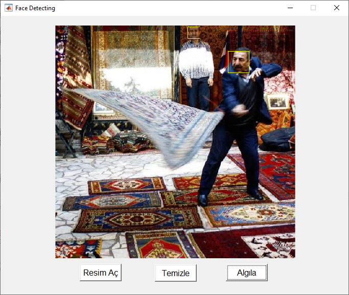
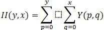
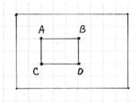
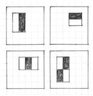
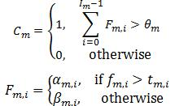
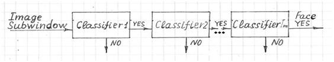
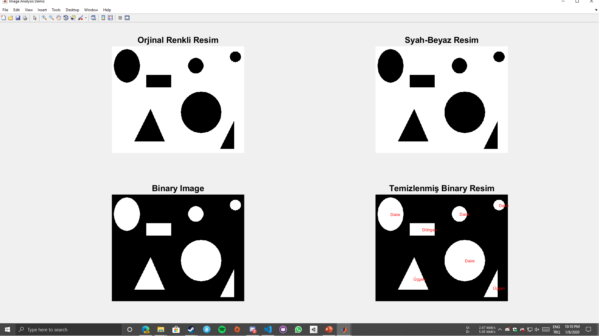
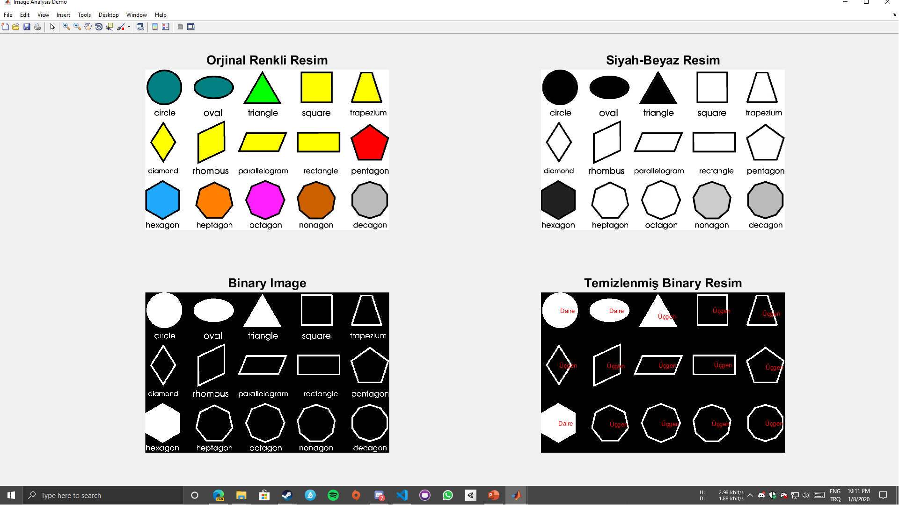

# Matlab ile Yüz Tanıma Programı

## Arayüz

MatLab GUIDE editorü ile resimde görülen arayüz hazırlandı ve FaceDetection.fig isminde kaydedildi.

### FaceDetection.fig


<div style="page-break-after: always;"></div>

## MatLab kodu

### FaceDetection.m

```matlab
function varargout = FaceDetection(varargin)

% ------------------ARAYÜZ BAĞLANTILARI----------------------
gui_Singleton = 1;
gui_State = struct('gui_Name',       mfilename, ...
                   'gui_Singleton',  gui_Singleton, ...
                   'gui_OpeningFcn', @FaceDetection_OpeningFcn, ...
                   'gui_OutputFcn',  @FaceDetection_OutputFcn, ...
                   'gui_LayoutFcn',  [] , ...
                   'gui_Callback',   []);
if nargin && ischar(varargin{1})
    gui_State.gui_Callback = str2func(varargin{1});
end

if nargout
    [varargout{1:nargout}] = gui_mainfcn(gui_State, varargin{:});
else
    gui_mainfcn(gui_State, varargin{:});
end
% ------------------ARAYÜZ BAĞLANTILARI SONU------------------

% ARAYÜZ ÇIKMADAN ÖNCE KOŞAN KOD
function FaceDetection_OpeningFcn(hObject, eventdata, handles, varargin)

% hObject    Arayüzü nesnesi
% handles    Kullanıcı ile ilgili dataların tutulduğu sınıf
% varargin   Komut satırı argümanı

% Çıktı için varsayılan komut satırı
handles.output = hObject;
handles.img = 0;
% handles yapısını güncelle
guidata(hObject, handles);


% Bu fonksiyonun çıktısı komut satırına döner
function varargout = FaceDetection_OutputFcn(hObject, eventdata, handles)
% varargout  Geri dönen çıktı parametreleri

% handles ile çıkan varsayılan çıktı parametreleri
varargout{1} = handles.output;

% 'Algıla' butonuna basılınca çalışacak olan kod
function FaceDetection_Callback(hObject, eventdata, handles)

if(handles.img == 0)
    return;
end
faceDetector = vision.CascadeObjectDetector();
% handles.img deki yüzleri algılıyor
bbox= step(faceDetector,handles.img); % Viola-Jones Algoritması Çalışıyor
% yüzlerin etrafına dörtgen çiziyor
handles.img = insertShape(handles.img, 'Rectangle', bbox);
imshow(handles.img);% Resmi gösteriyor
guidata(hObject, handles);%Veri güncellemesi

% 'Aç' butonuna tıklayınca çalışacak olan kod
function OpenImage_Callback(hObject, eventdata, handles)

[filename, pathname] = uigetfile('*.jpg', 'Select a jpg image'); % Resim seç
if ~isequal(filename,0)
   pathfile=fullfile(pathname, filename);  % Resim yoluna ulaş
   handles.img = imread(pathfile);     % 'pathfile' da bulunan resmi oku
   imshow(handles.img);% Resmi göster
   guidata(hObject, handles);% Veri güncellemesi
end

% 'Temizle' butonuna tıklayınca çalışacak kod
function ClearImage_Callback(hObject, eventdata, handles)

cla
handles.img = 0;
guidata(hObject, handles);
```

<div style="page-break-after: always;"></div>

# Program Çıktıları

<p align="center" >
        
</p>

<div style="page-break-after: always;"></div>

# Viola-Jones Algoritması Kullanılarak Yüz Tanıma

```matlab
faceDetector = vision.CascadeObjectDetector(); % handles.img deki yüzleri algılıyor
bbox= step(faceDetector,handles.img); % Viola-Jones Algoritması Çalışıyor
```

Obje algılama mekanizmalarında Viola-Jones algoritması oldukça sık kullanılır. Algoritmanın ana özelliği, eğitimin yavaş fakat tespitinin hızlı olması. Bu algoritma Haar temel özellik filtreleri kullanır, bu sayede çarpma işlemleri yapmaz.

Viola-Jones algoritmasının verimliliği ilk başta resmin integrali alınarak ciddi bir şekilde hızlandırılabilir.



İntegral görüntü, Haar ekstraktörlerinin integrallerinin sadece dört sayı eklenerek hesaplanmasını sağlar. Örneğin, ABCD alanının görüntü integrali II (yA, xA) - II (yB, xB) - II (yC, xC) + II (yD, xD) olarak hesaplanır.



Algılama, bir algılama penceresinin içinde gerçekleşir. Minimum ve maksimum pencere boyutu seçilir ve her boyut için bir kayan adım boyutu seçilir. Daha sonra algılama penceresi görüntü boyunca aşağıdaki gibi taşınır:

1. Minimum pencere boyutunu ve bu boyuta karşılık gelen kaydırma adımını ayarlanır.
2. Seçilen pencere boyutu için, pencereyi aynı adımla dikey ve yatay olarak kaydırılır. Her adımda, bir dizi N yüz tanıma filtresi uygulanır. Bir filtre olumlu yanıt verirse, yüz geçerli dulda algılanır.
3. Pencerenin boyutu maksimum boyut ise prosedürü durdurulur. Aksi takdirde, pencerenin boyutunu ve ilgili kayma adımını seçilen bir sonraki boyuta getirilir ve 2. adıma gidilir.

Her yüz tanıma filtresi (N filtre kümesinden) bir dizi kademeli bağlı sınıflandırıcı içerir. Her sınıflandırıcı, algılama penceresinin dikdörtgen bir alt kümesine bakar ve bir yüz gibi görünüp görünmeyeceğini belirler. Varsa, bir sonraki sınıflandırıcı uygulanır. Tüm sınıflandırıcılar olumlu bir cevap verirse, filtre olumlu bir cevap verir ve yüz tanınır. Aksi takdirde N filtre kümesindeki bir sonraki filtre çalıştırılır.

Her sınıflandırıcı Haar özellikli ekstraktörlerden (zayıf sınıflandırıcılar) oluşur. Her Haar özelliği, birbirine bağlı küçük dikdörtgen alanların 2-B integrallerinin ağırlıklı toplamıdır. Ağırlıklar ± 1 değer alabilir. Şekil 2, kapalı algılama penceresine göre Haar özelliklerinin örneklerini göstermektedir. Gri alanlar pozitif ağırlığa ve beyaz alanlar negatif ağırlığa sahiptir. Haar özellikli aspiratörler algılama penceresi boyutuna göre ölçeklendirilir.



Sınıflandırıcı kararı şu şekilde:



fm, i, 2-B integrallerin ağırlıklı toplamıdır. i-inci özellik çıkarıcı için karar eşiğidir. am, i ve βm, i, i-inci özellik çıkarıcı ile ilişkili sabit değerlerdir. θm, m'inci sınıflandırıcı için karar eşiğidir.



Kaskat mimarisi çok verimlidir çünkü en az özelliğe sahip sınıflandırıcılar kaskatın başlangıcına yerleştirilir ve gerekli toplam hesaplamayı en aza indirir. Özellik eğitimi için en popüler algoritma AdaBoost'tur.

<div style="page-break-after: always;"></div>

# Matlab ile Şekil algılama

```matlab
clc;
close all;
imtool close all;
clear;  
workspace;  
fontSize = 20;

% Resim aç
[baseFileName, folder] = uigetfile('*.*', 'Specify an image file');
fullImageFileName = fullfile(folder, baseFileName);
if folder == 0
  return;
end
% Resmi diziye çevir
[rgbImage, storedColorMap] = imread(fullImageFileName);
[rows, columns, numberOfColorBands] = size(rgbImage)
% Eğer monochrome ise renkliye çevir
% 8-bit olup olmadığını kontrol et
if strcmpi(class(rgbImage), 'uint8')
  % 256 gri seviyesi için işaretle
  eightBit = true;
else
  eightBit = false;
end
if numberOfColorBands == 1
  if isempty(storedColorMap)
    % Boş gri resim
    % Monochrome resimleri 3 RGB renk levhasına koyabileceğimiz 3D gerçek renk resmi oluştur
    rgbImage = cat(3, rgbImage, rgbImage, rgbImage);
  else
    % Indexlenmiş resim
    rgbImage = ind2rgb(rgbImage, storedColorMap);
    % ind2rgb() double'a çevir ve 0-1 aralığına olacak şekilde normalini al
    % Eğer gerekirse 0-255 aralığında olan uint8'e dönüştür
    if eightBit
      rgbImage = uint8(255 * rgbImage);
    end
  end
end
% Orjinal resimi göster
subplot(2, 2, 1);
imshow(rgbImage);
set(gcf, 'Position', get(0,'Screensize')); % Tak ekrana genişlet
set(gcf,'name','Image Analysis Demo','numbertitle','off')
drawnow; % Şimdi göster
if numberOfColorBands > 1
  title('Orjinal Renkli Resim', 'FontSize', fontSize);
  grayImage = rgbImage(:,:,1);
else
  caption = sprintf('Orjinal indekslenmiş resim\n(Depolanmış renk haritası ile gerçek renklere çevrildi)');
  title(caption, 'FontSize', fontSize);
  grayImage = rgbImage;
end
subplot(2, 2, 2); % Görüntüle
imshow(grayImage, []);
title('Siyah-Beyaz Resim', 'FontSize', fontSize);
binaryImage = grayImage < 100; % Görüntüyü ikilleştir
subplot(2, 2, 3); % Görüntüle
imshow(binaryImage, []);
title('Binary Image', 'FontSize', fontSize);
% Ufak objeleri sil
binaryImage = bwareaopen(binaryImage, 300);
subplot(2, 2, 4); % Göster
imshow(binaryImage, []);
title('Temizlenmiş Binary Resim', 'FontSize', fontSize);
[labeledImage numberOfObjcts] = bwlabel(binaryImage);
blobMeasurements = regionprops(labeledImage,'Perimeter','Area', 'Centroid');
% KARE ((a>17) && (a<20))
% DAİRE ((a>13) && (a<17))
% ÜÇGEN ((a>20) && (a<30))
circularities = [blobMeasurements.Perimeter].^2 ./ (4 * pi * [blobMeasurements.Area])
hold on;
% İsimlerini göster
for blobNumber = 1 : numberOfObjcts
  if circularities(blobNumber) < 1.19
    message = sprintf("#%d'inci Nesnenin daireselliği is %.3f, bu obje bir Dairedir",...
      blobNumber, circularities(blobNumber));
    theLabel = 'Daire';
  elseif circularities(blobNumber) < 1.53
    message = sprintf("#%d'inci Nesnenin daireselliği is %.3f, bu obje bir Dörtgendir",...
      blobNumber, circularities(blobNumber));
    theLabel = 'Dötrgen';
  else
    message = sprintf("#%d'inci Nesnenin daireselliği is %.3f, bu obje bir Üçgendir",...
      blobNumber, circularities(blobNumber));
    theLabel = 'Üçgen';
  end
  text(blobMeasurements(blobNumber).Centroid(1), blobMeasurements(blobNumber).Centroid(2),...
    theLabel, 'Color', 'r');
  uiwait(msgbox(message));
end
```

<div style="page-break-after: always;"></div>

# Program Çıktıları

<p align="center" >
        
        
</p>
